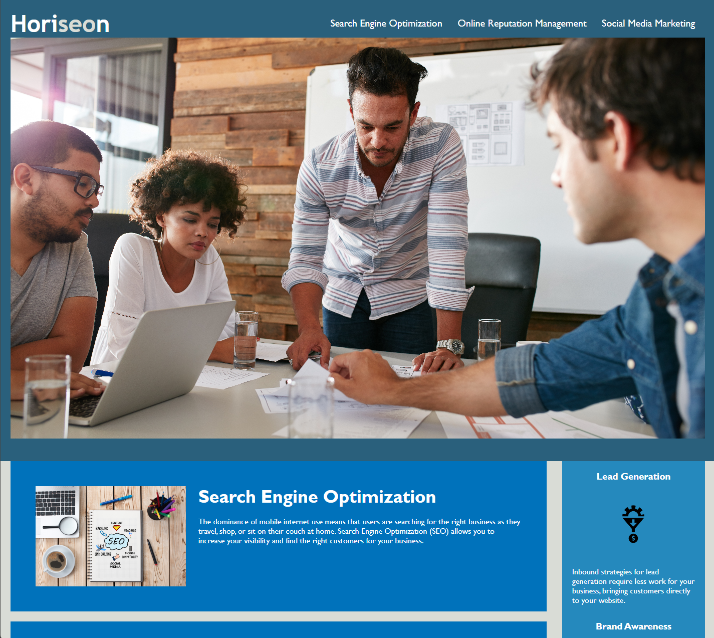

# Challenge 01- HTML, CSS, and Git: Code Refactor

## Description

A marketing agency wanted a codebase that follows accessibility standards so that the website will be optimized for search engines.

From this code refactor project, I learned about semantic HTML elements, a logical structure of elements, alt attributes for accessible and sequential order of heading attributes.

## Changelog

- Reorganized html and CSS with semantic HTML elements without affecting the original webpage.
- Grouped the same properties of some multiple classes as one in CSS and removed duplicate properties to be minimalized.

## Webpage (link & webpage)

https://yelzaw.github.io/01-html-css-git-homework/

## Credit
-UNB Coding Bootcamp
-https://coding-boot-camp.github.io/full-stack/githubprofessional-readme-guide

## License

MIT License

